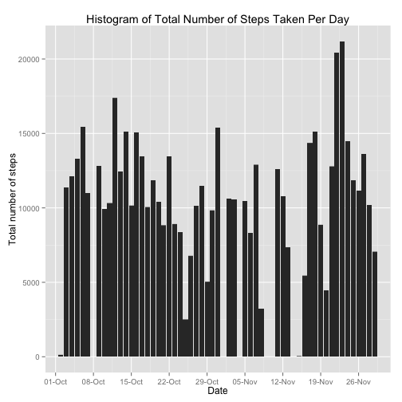
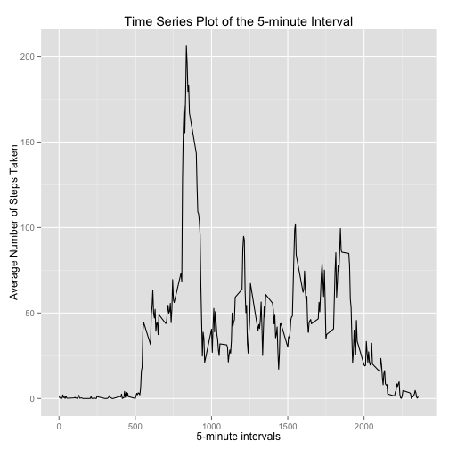
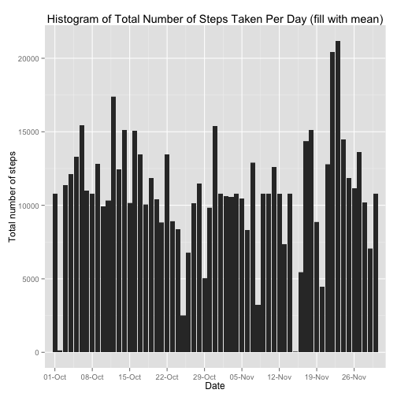
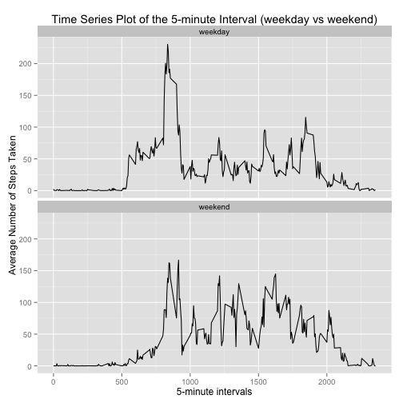

"Reproducible Research: Peer Assessment 1"
===============================================


## Basic settings

We fixed a few settings to be use during this analysis:

```r
setwd("~/Documents/ProgramsGitHub/RepData_PeerAssessment1")  # working directory
echo = TRUE      # Always make code visible
library(ggplot2) # graph - library
library(scales)  # graph - to be able to use date breaks
library(plyr)    # to be able to use join
```


## Loading and preprocessing the data

We download the data set:

```r
unzip("activity.zip")        # unzipping the data
data <- read.csv("activity.csv", colClasses = c("integer", "Date", "factor"))     # loading the data
```

First lines and dimension of the data:

```r
head(data)                   # few lines of data
```

```
##   steps       date interval
## 1    NA 2012-10-01        0
## 2    NA 2012-10-01        5
## 3    NA 2012-10-01       10
## 4    NA 2012-10-01       15
## 5    NA 2012-10-01       20
## 6    NA 2012-10-01       25
```

```r
dim(data)                    # dimension of the data
```

```
## [1] 17568     3
```


## What is mean total number of steps taken per day?

In this part of the analysis we are not going to consider the missing values.

```r
datawithoutNA <- na.omit(data)                      # new data without NA 
rownames(datawithoutNA)<-1:nrow(datawithoutNA)      # renumering the new data 
```

First lines and dimension of the data whithout missing values:

```r
head(datawithoutNA)                                 # few lines of new data
```

```
##   steps       date interval
## 1     0 2012-10-02        0
## 2     0 2012-10-02        5
## 3     0 2012-10-02       10
## 4     0 2012-10-02       15
## 5     0 2012-10-02       20
## 6     0 2012-10-02       25
```

```r
dim(datawithoutNA)                                  # dimension of the new data
```

```
## [1] 15264     3
```

We contruct an histogram of the total number of steps taken per day:

```r
g <- ggplot(datawithoutNA,aes(date,steps))          # data to be use
g + geom_histogram(stat="identity") + labs(title = "Histogram of Total Number of Steps Taken Per Day", x = "Date", y = "Total number of steps") +scale_x_date(limits=c(as.Date("2012-10-02"),as.Date("2012-11-29")),breaks = date_breaks("week"),labels = date_format("%d-%b"))   # histogram / labels / breaks
```

 

We calculate the **mean** and **median** total number of steps taken per day.

```r
totalstepsperday <- aggregate(datawithoutNA$steps, list(Date = datawithoutNA$date), sum)   #steps per day
```


```r
mean(totalstepsperday$x)
```

```
## [1] 10766
```

```r
median(totalstepsperday$x)
```

```
## [1] 10765
```

## What is the average daily activity pattern?

We construct a time series plot of the 5-minute interval (x-axis) and the average number of steps taken, averaged across all days (y-axis):

```r
averageperinterval<-aggregate(datawithoutNA$steps, list( interval= as.numeric(as.character(datawithoutNA$interval))), mean)                                            # Calculate the average 
names(averageperinterval)[2] <- "average"                   # rename second column
```


```r
g <- ggplot(averageperinterval,aes(interval,average))           # data to be use
g + geom_line() + labs(title = "Time Series Plot of the 5-minute Interval", x = "5-minute intervals", y = "Average Number of Steps Taken")                          # graph / labels
```

 

The 5-minute interval, on average across all the days in the dataset, which contains the maximum number of steps is:


```r
averageperinterval[averageperinterval$average == max(averageperinterval$average),]   
```

```
##     interval average
## 104      835   206.2
```

## Imputing missing values

Note that there are a number of days/intervals where there are missing values (coded as `NA`). The presence of missing days may introduce bias into some calculations or summaries of the data.

The number of missing values in the original data set is:

```r
sum(is.na(data$steps))     # number of missing values
```

```
## [1] 2304
```

To fill the missing values we are going to use then mean for that 5-min interval. We also create a new data set by using this strategy.


```r
filldata<-data                                                  # create the new data
aux<-filldata[is.na(filldata$steps),c(1,3)]                     # auxiliar data to merge 
aux<-join(aux,averageperinterval,by="interval")                 # merge auxiliar data wit averages
filldata[is.na(filldata$steps),]$steps <- aux$average           # fill the missing data
rm(aux)                                                         # delete auxiliar data
```

First lines and dimension of the data with filling missing values:

```r
head(filldata)                                                  # few lines of the new data
```

```
##     steps       date interval
## 1 1.71698 2012-10-01        0
## 2 0.33962 2012-10-01        5
## 3 0.13208 2012-10-01       10
## 4 0.15094 2012-10-01       15
## 5 0.07547 2012-10-01       20
## 6 2.09434 2012-10-01       25
```

```r
dim(filldata)                                                   # dimension
```

```
## [1] 17568     3
```

We construct a histogram of the total number of steps taken each day with the new data set:


```r
g <- ggplot(filldata,aes(date,steps))          # data to be use
g + geom_histogram(stat="identity") + labs(title = "Histogram of Total Number of Steps Taken Per Day (fill with mean)", x = "Date", y = "Total number of steps") +scale_x_date(limits=c(as.Date("2012-10-02"),as.Date("2012-11-29")),breaks = date_breaks("week"),labels = date_format("%d-%b"))   # histogram / labels / breaks
```

 

We calculate the **mean** and **median** total number of steps taken per day for the new data:

```r
filltotalstepsperday <- aggregate(filldata$steps, list(Date = filldata$date), sum)   #steps per day for the new data
```


```r
mean(filltotalstepsperday$x)
```

```
## [1] 10766
```

```r
median(filltotalstepsperday$x)
```

```
## [1] 10766
```

We compare them with the two before imputing missing data:

```r
mean(filltotalstepsperday$x) - mean(totalstepsperday$x)
```

```
## [1] 0
```

```r
median(filltotalstepsperday$x) -median(totalstepsperday$x) 
```

```
## [1] 1.189
```

After imputing (fill-in) the missing data, the new mean is the same as the old mean and the new median is greater than that of the old median. 

## Are there differences in activity patterns between weekdays and weekends?

In this part of the analysis we are going to consider the new data (filldata).

We create a new factor variable in the new data set with two levels "weekday" and "weekend" indicating whether a given date is a weekday or weekend day.


```r
filldata$weekdays<-as.factor((weekdays(filldata$date)))      # include new factor variable ( days )
filldata$weekdays<-mapvalues(filldata$weekdays, from = c("Monday", "Tuesday","Wednesday","Thursday","Friday","Saturday","Sunday"), to = c("weekday","weekday","weekday","weekday","weekday","weekend","weekend"))            # weekday or weekend
head(filldata)          # few lines of new data
```

```
##     steps       date interval weekdays
## 1 1.71698 2012-10-01        0  weekday
## 2 0.33962 2012-10-01        5  weekday
## 3 0.13208 2012-10-01       10  weekday
## 4 0.15094 2012-10-01       15  weekday
## 5 0.07547 2012-10-01       20  weekday
## 6 2.09434 2012-10-01       25  weekday
```

We construct a panel plot containing a time series plot of the 5-minute interval (x-axis) and the average number of steps taken, averaged across all weekdays or weekend days (y-axis):

```r
avgsteps <- aggregate(filldata$steps, list(interval = as.numeric(as.character(filldata$interval)), weekdays = filldata$weekdays),FUN = "mean")                  # calculate the average 
names(avgsteps)[3] <- "average"                              # rename third column
```


```r
g <- ggplot(avgsteps,aes(interval,average))           # data to be use
g + geom_line() + facet_wrap(~ weekdays,ncol=1) + labs(title = "Time Series Plot of the 5-minute Interval (weekday vs weekend)", x = "5-minute intervals", y = "Average Number of Steps Taken")  # graph / facets / labels
```

 
